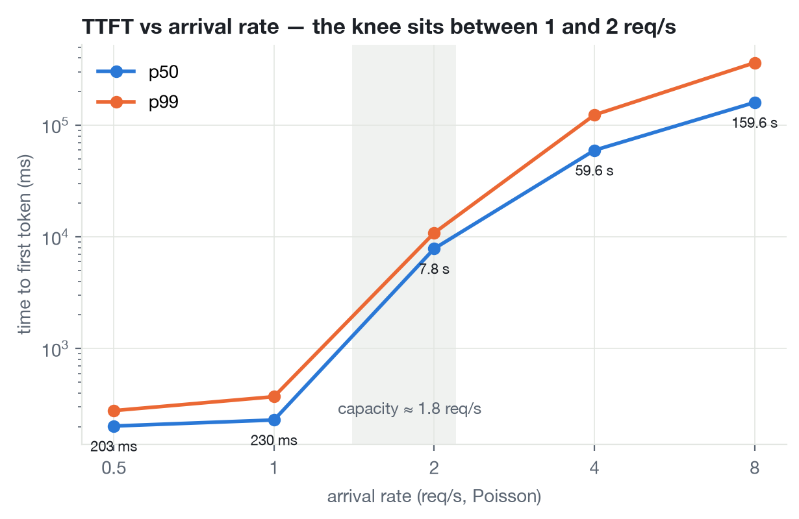
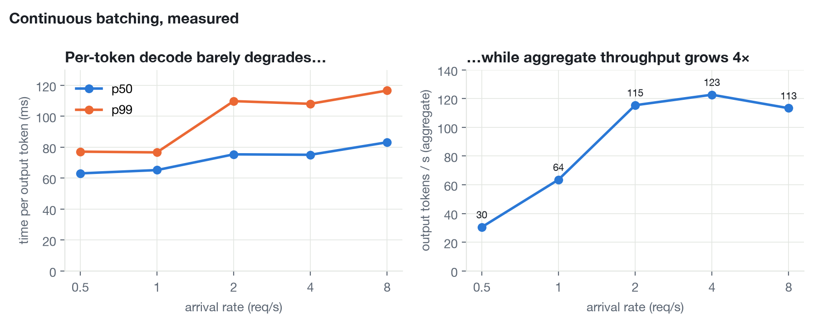
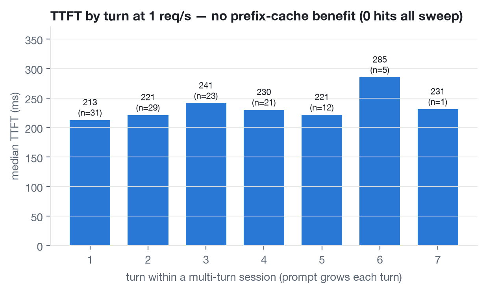

# What continuous batching actually does to your latency curves

_Post #1 of a build-in-public series on inference serving. Draft from measured data (2026-08-22); prose still to be written by Rodrigo._

## Setup

- Hardware: 1× RTX 5090 (32 GB, Blackwell sm_120), RunPod secure cloud, US, $0.99/hr
- Model: [Inferact/Qwen3.8-27B-NVFP4](https://huggingface.co/Inferact/Qwen3.8-27B-NVFP4) — 27B dense hybrid (48/64 layers Gated DeltaNet linear attention), NVFP4 weights, FP8 KV cache
- Engine: vLLM 0.27.1 (uv venv, torch cu128), `--enforce-eager`, `--linear-backend marlin`, `--attention-backend TRITON_ATTN`, `--max-model-len 32768`, prefix caching on
- Load: open-loop Poisson arrivals, 32 multi-turn chat sessions sharing a system prompt, 120 s per rate, thinking disabled, `max_tokens=120` (generator: `manifold/loadgen`)

Why those backends: vLLM's default NVFP4 GEMM and attention kernels on this stack are FlashInfer JIT builds that need CUDA ≥ 12.9 for sm_120; the image ships 12.8. Marlin (FP4→BF16 dequant) and Triton attention are the precompiled fallbacks. So these numbers are a *floor* for the 5090, not its ceiling.

## The budget before the first request

`Model loading took 23.94 GiB` → `Available KV cache memory: 2.12 GiB` → `GPU KV cache size: 53,399 tokens` → `Maximum concurrency for 32,768 tokens per request: 1.63x`.

A 32 GB card can *hold* a 27B model; it can *batch* about 53k tokens of context. Everything below follows from that.

## The experiment

Sweep arrival rate 0.5 → 8 req/s.

| rate | TTFT p50 | TTFT p99 | TPOT p50 | output tok/s | errors |
|---|---|---|---|---|---|
| 0.5 | 203 ms | 278 ms | 63 ms | 30 | 0 |
| 1 | 230 ms | 371 ms | 65 ms | 64 | 0 |
| 2 | 7.8 s | 10.9 s | 75 ms | 115 | 0 |
| 4 | 59.6 s | 123 s | 75 ms | 123 | 0 |
| 8 | 160 s | 362 s | 83 ms | 113 | 85 client timeouts |

## What the curves say

1. **The knee is between 1 and 2 req/s, and it is a cliff.** Throughput saturates at ~115–123 output tok/s; at ~66 output tokens per request that is a capacity of ≈1.8 req/s. Below it TTFT is flat at ~200 ms. Above it, with open-loop arrivals, TTFT is queueing time and grows without bound: 8 s, 60 s, 160 s.
2. **Continuous batching is the TPOT line.** Per-token decode goes 63 → 83 ms while aggregate throughput goes up 4×. The GPU serves ~8 concurrent streams for ~1.3× the per-token cost of one.
3. **Prefix cache: 0 hits in 801,405 queries.** vLLM logged `Setting attention block size to 1568 tokens to ensure that attention page size is >= mamba page size`. On a hybrid GDN/attention model the KV block is sized by the Mamba state page; prefix caching only reuses *whole* blocks, and chat prefixes under 1,568 tokens never complete one. Verified with a 1,590-token shared system prompt: second request, hits +1568 exactly. Turn-N TTFT equals turn-1 TTFT (chart below) for this reason.

## Honest caveats

- Marlin + eager + Triton attention is the slow path. A community run with native sm_120 FP4 kernels, CUDA graphs and MTP reports ~160 tok/s single-stream vs our ~16. Follow-up post: same model, native kernels (vLLM ≥ 0.28 or cu129 toolchain), measured delta.
- Single-stream run after the sweep read slower (TPOT 84 ms) than the 0.5 req/s run (63 ms); likely leftover work from the 85 timed-out requests. Will re-measure fresh.
- 8 req/s "errors" are the load generator's 300 s client timeout, i.e. overload behaving as designed.

## Why this matters at fleet scale

One replica's knee (≈1.8 req/s here) is the input to every fleet question: routing (send the request where the knee is furthest), autoscaling (add a replica *before* the knee), deployment safety (a canary past its knee looks broken when the model is fine). And the prefix-cache result is a warning for M1: prefix-aware routing is only worth building if the engine can actually hit — block size is a property of the *model architecture*, not the router.

Cost of this post: $3.00 of RunPod credit (≈3 h of RTX 5090 at $0.99/hr plus an 80 GB volume), including ~$0.17 learning that `--docker-args` appends to the image ENTRYPOINT.

---

_Code, raw CSVs, startup log and chart script: `bench/m0/` in [manifold-serve](https://github.com/rogarcia/manifold-serve)._
